<h1 align="center"></h1>

A small operating system for a cube-shaped ESP32-S3 device with a round-cornered
480×480 AMOLED touchscreen — the
[Waveshare ESP32-S3-Touch-AMOLED-2.16](https://www.waveshare.com/wiki/ESP32-S3-Touch-AMOLED-2.16).

A cube has facets; so does this. Apps are faces of one system rather than
separate firmwares, and only the one you are looking at costs any RAM.

<p align="center">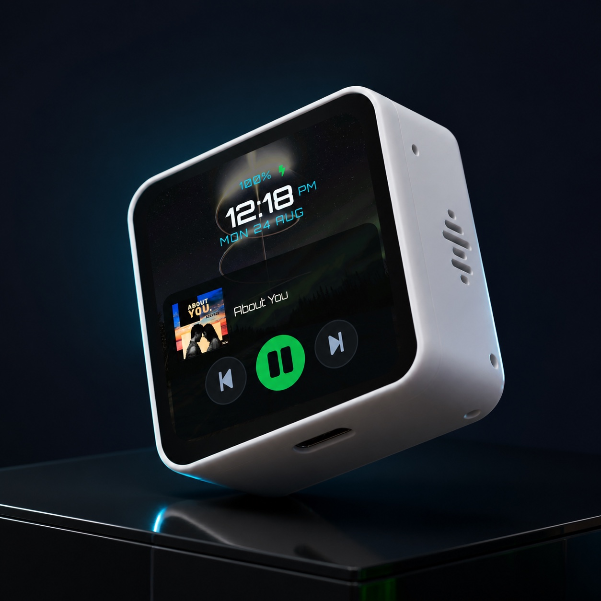 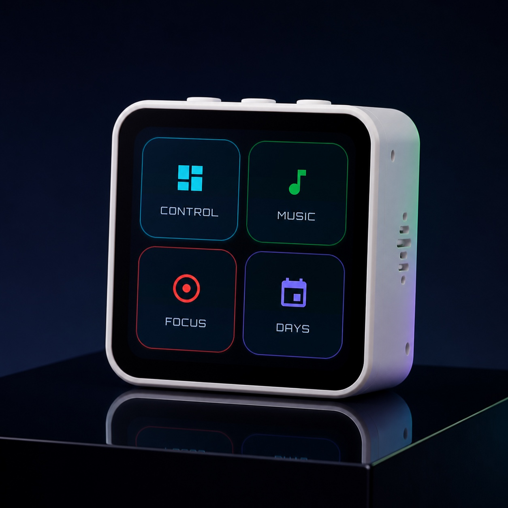</p>

<p align="center"><sub>Studio renders built from the real enclosure photography and the cube's own framebuffer captures.</sub></p>

## What it is

The ESP32-S3 has 512 KB of internal SRAM, and after Wi-Fi and a display driver
have taken their share you are left with roughly 25 KB. That number, not flash
and not PSRAM, is what decides whether a feature fits. Facet is built around it:

- **Apps are built when opened and freed when closed.** A switch costs 1–26 ms,
  against ~2.7 s for a reboot, so there is no reason to page apps through OTA
  partitions. Adding a twentieth app costs nothing while it is closed.
- **State lives on the microSD card**, not in RAM and not in flash. Each app
  writes an opaque blob to `/sdcard/apps/<id>.bin` when it closes and reads it
  back when it opens, with NVS as a fallback when no card is present.
- **Assets stream to the card and are decoded from it.** The lock-screen
  wallpaper is fetched in the background at exactly panel resolution and never
  exists whole in RAM.
- **No VPN on the device.** Reaching private services goes through a Tailscale
  Funnel HTTPS endpoint with a bearer token, so TLS costs ~3 KB transiently per
  call instead of ~42 KB of permanent task stacks. That decision is what buys
  the frame rate; see [docs/ARCHITECTURE.md](docs/ARCHITECTURE.md).

## Built in

| App | What it does | Hold right key |
|---|---|---|
| **CONTROL** | Settings and diagnostics in one scrolling column of cards: wallpaper pool, manual DAYS refresh, rotation calibration, battery and drain rate, network, system counters | Fetch a new wallpaper |
| **MUSIC** | A direct Spotify remote with cover art, queue lookahead, device transfer and volume controls | Play / pause |
| **FOCUS** | A Pomodoro timer you drive by turning the cube. Rotate to pick 60/30/10/5 and start; lay it flat to pause | Cancel the session |
| **DAYS** | A local-first countdown with a colour-changing progress bar. Tap it for a secure, one-time QR that opens your own phone editor. | Refresh now |

Sound is authored, not sampled — see
[assets/sounds/CREDITS.md](assets/sounds/CREDITS.md).

Plus a lock screen: a HUD clock with a battery ring and a sweeping arc, backed
by SNTP and a battery-backed RTC so the time is right the instant it wakes.

### Wi-Fi setup from your phone

There is no on-screen keyboard any more. CONTROL has a **PAIR** card: press it,
the cube shows a six-digit code and turns Wi-Fi off, and a web page on your
phone talks to it over Bluetooth — network list, real keyboard, done. Networks
you have joined before are marked *saved* and reconnect without a password.

The two radios cannot run at once on this board, so pairing takes Wi-Fi down for
the duration and restores it however the session ends. See
[docs/ARCHITECTURE.md](docs/ARCHITECTURE.md) for the shape and
[docs/HARDWARE.md §7g](docs/HARDWARE.md) for the measurements behind it.

## Screens

<table align="center"><tr>
<td align="center">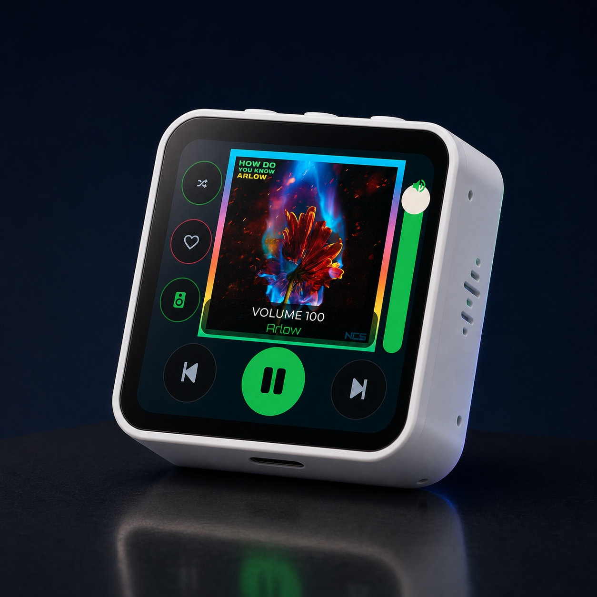<br/><b>MUSIC</b><br/><sub>now playing; volume slider being raised to 100</sub></td>
<td align="center">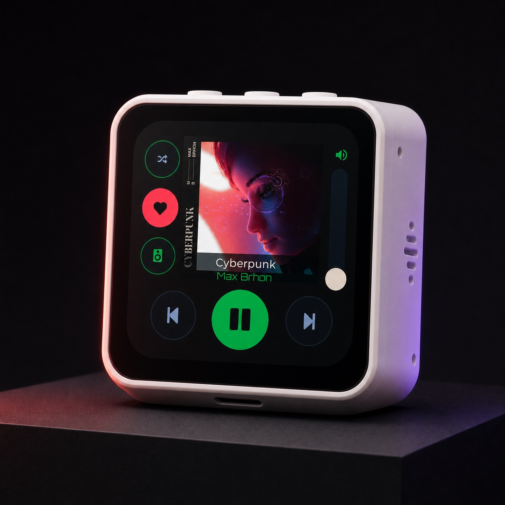<br/><b>MUSIC · liked</b><br/><sub>the heart fills red without leaving now playing</sub></td>
<td align="center">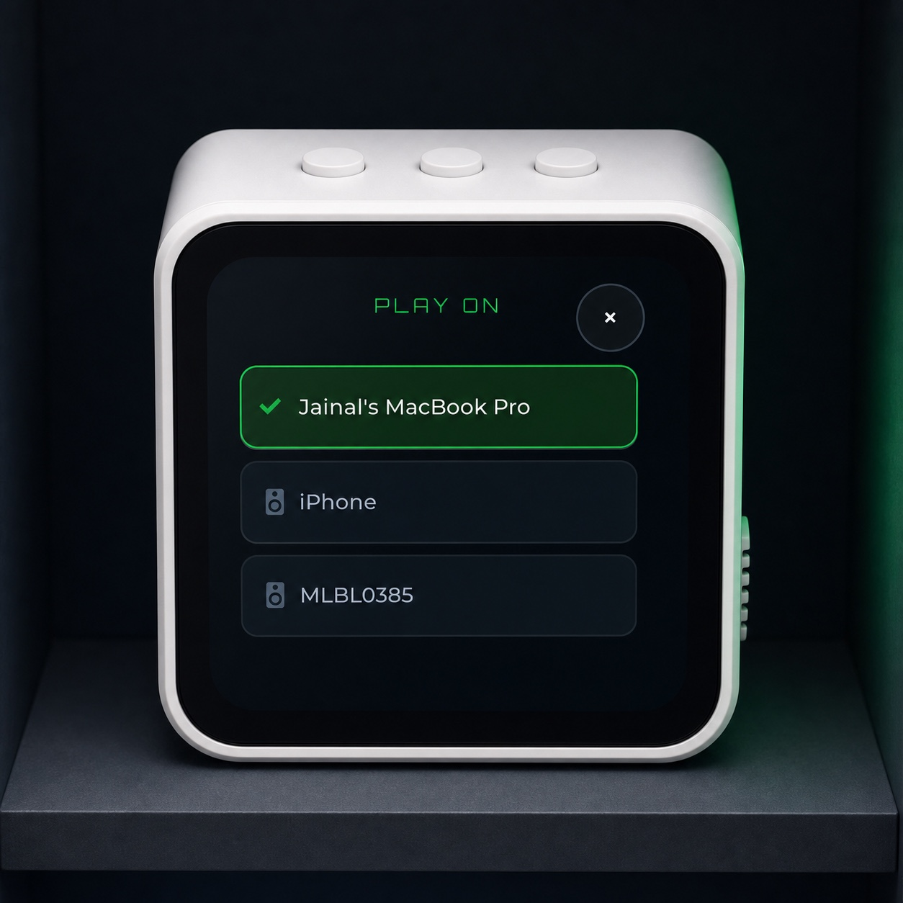<br/><b>MUSIC · devices</b><br/><sub>pick which speaker or computer plays</sub></td>
</tr><tr>
<td align="center">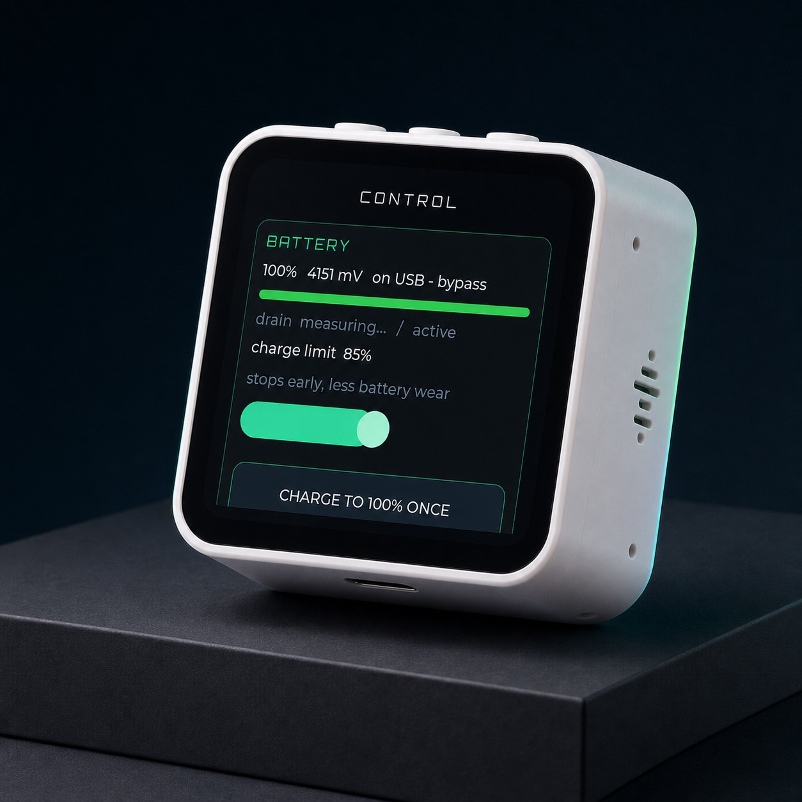<br/><b>CONTROL</b><br/><sub>battery care: charge limit and the 100%-once override</sub></td>
<td align="center">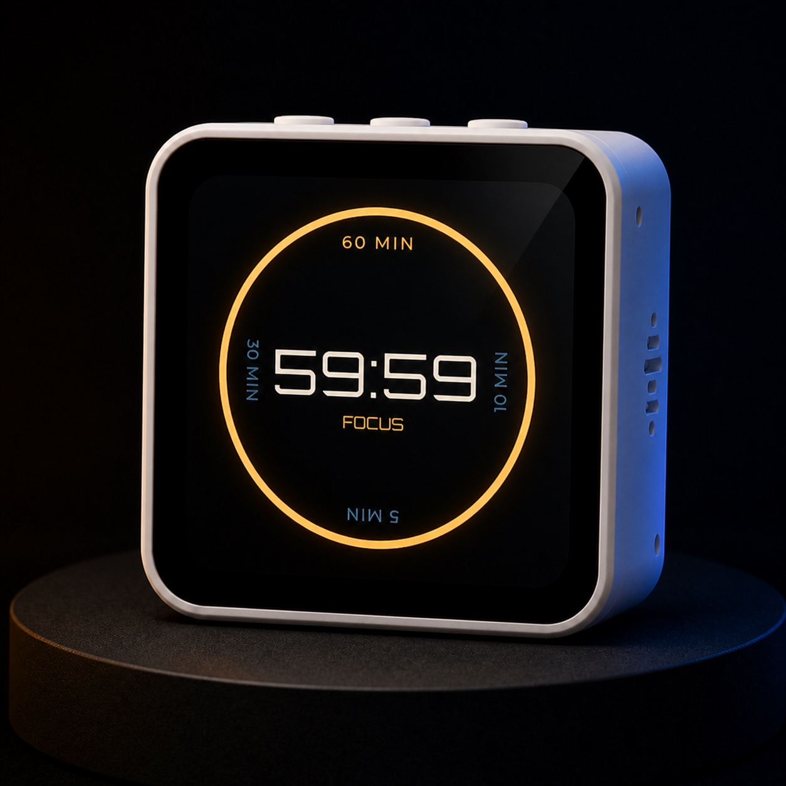<br/><b>FOCUS · running</b><br/><sub>the first second of a 60-minute session</sub></td>
<td align="center">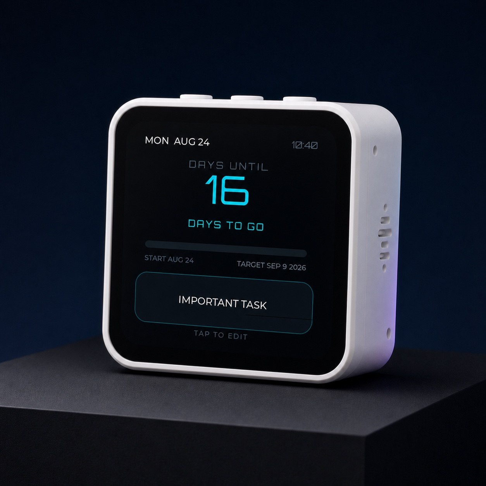<br/><b>DAYS</b><br/><sub>countdown with a colour-shifting progress bar</sub></td>
</tr></table>

### The moments that make it Facet

These are the two gestures where the cube stops behaving like a tiny phone and
starts feeling like its own object: the whole OS revealed as four physical
faces, then the display breaking its own frame when the bezel comes alive.

<p align="center">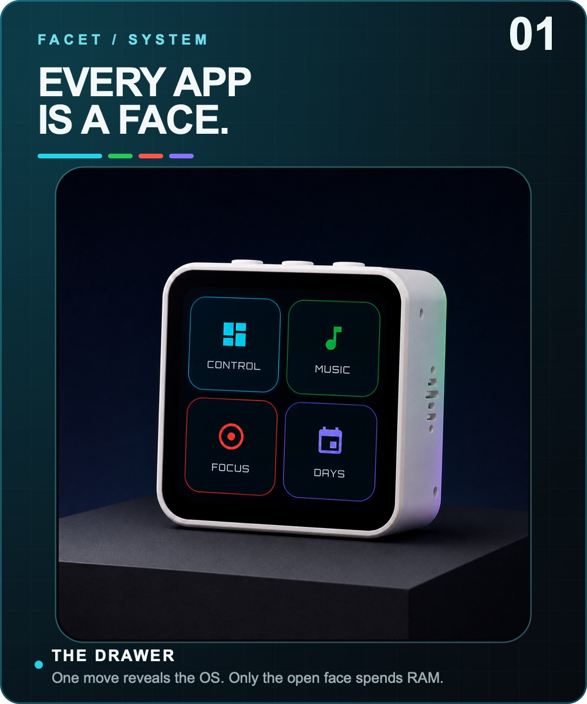 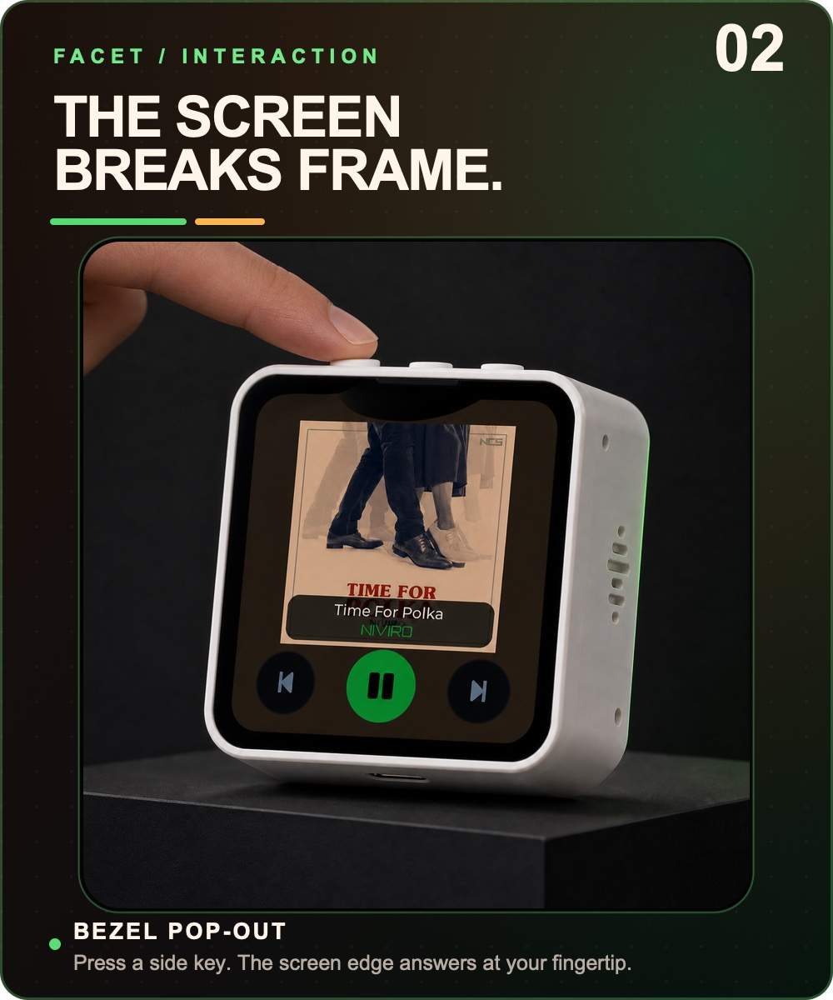</p>

### Every face, alive

Eight cubes, eight live states, one system. The lock screen anchors the scene;
MUSIC, CONTROL, FOCUS, DAYS, device transfer, liked state, and the drawer all
run around it.

<p align="center">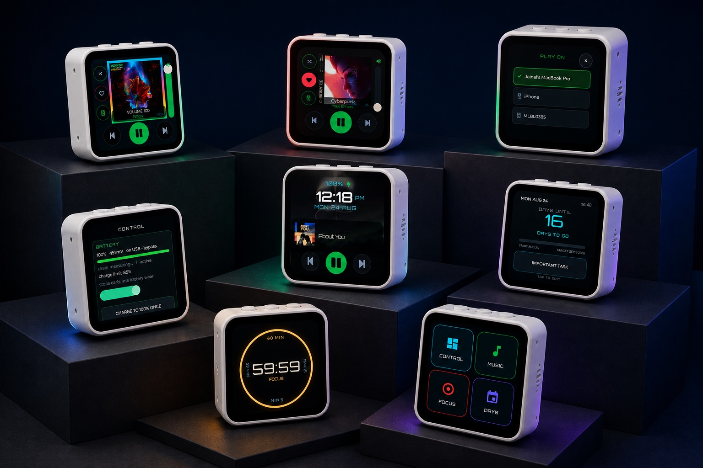</p>

Every interface shown here began as a capture taken by the device itself — hold
LEFT+RIGHT and it saves its framebuffer to the card (see CLAUDE.md,
*Autonomous hardware verification*). The studio scenes were generated from
those captures and photographs of the physical enclosure; no emulator was used.

## The three keys

Every app obeys the same contract, so nothing has to be re-learned per app.

| Key | Short press | Long press |
|---|---|---|
| **Left** (BOOT / minus, GPIO0) | Lock. Again while locked: sleep. | — |
| **Middle** (PWR, via the PMU) | Home | — |
| **Right** (plus, GPIO18) | Back one scene, or Home at an app's root | The app's primary action |

On the lock screen, holding the right key toggles **desk-clock mode**: the panel
stays lit indefinitely and the sweep ring turns amber.

## Build and flash

Requires [ESP-IDF v5.5](https://docs.espressif.com/projects/esp-idf/en/stable/esp32s3/get-started/)
or newer.

```sh
git clone https://github.com/jainal09/facet-os.git
cd facet-os
cp .env.example .env      # then fill it in
. $IDF_PATH/export.sh
idf.py set-target esp32s3
idf.py build
idf.py -p /dev/cu.usbmodem2101 flash monitor
```

Editing `.env` is enough — CMake regenerates the credentials header on the next
build. Nothing secret is ever written to a tracked file.

`managed_components/` is not committed; `idf.py build` restores it from
`main/idf_component.yml` and `dependencies.lock`. `components/` **is** committed
— the board BSP is forked there with six fixes the upstream one needs
([docs/HARDWARE.md §9](docs/HARDWARE.md)).

If the board stops accepting a flash, [docs/HARDWARE.md §8](docs/HARDWARE.md)
has the recovery sequence. A connected battery is usually why unplugging USB
does not power-cycle it.

## Configuration

All of it lives in `.env`:

| Variable | Notes |
|---|---|
| `WIFI_SSID` / `WIFI_PASSWORD` | Boot credentials; the WI-FI app overrides them at runtime |
| `STT_ENDPOINT_URL` | An HTTPS endpoint to poll — a Tailscale Funnel URL in practice |
| `STT_BEARER_TOKEN` | Leave empty to send no `Authorization` header |
| `TIMEZONE` | POSIX TZ string, e.g. `EST5EDT,M3.2.0,M11.1.0` or `IST-5:30` |
| `NTP_SERVER` | Defaults to `pool.ntp.org` |
| `UNSPLASH_KEY` | Unsplash **Access Key** only. Leave empty to disable wallpapers. |
| `UNSPLASH_QUERY` | Wallpaper themes separated by `;`, one picked at random per download |
| `BROKER_URL` | Public Facet broker origin; required for multi-user Spotify login |
| `BROKER_TOKEN` | Unique bearer for this cube; must match exactly one server `BROKER_USERS` entry |
| `SPOTIFY_CLIENT_ID` / `SPOTIFY_REFRESH_TOKEN` | Legacy brokerless mode only; leave empty with a broker |

Only the Unsplash Access Key belongs on the device — public read endpoints use
Client-ID auth. The Secret Key is for OAuth flows Facet does not use, so it
never reaches the firmware.

## Documentation

- **[docs/ARCHITECTURE.md](docs/ARCHITECTURE.md)** — the app model, the state
  store, the button contract, and how to write a new app.
- **[docs/HARDWARE.md](docs/HARDWARE.md)** — the board itself: pin map, the
  sdkconfig that works, the memory budget, rotation, the PMU, recovery, and
  every pitfall found the hard way. Read the pitfalls before debugging anything.

## License

MIT — see [LICENSE](LICENSE).
