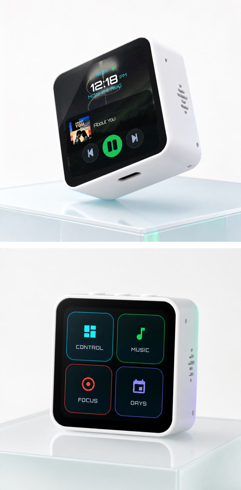
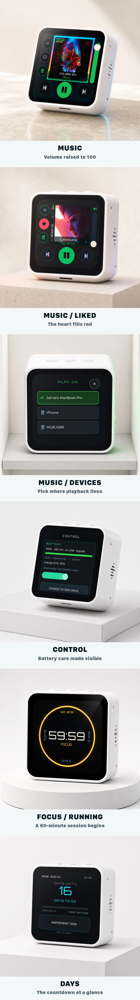
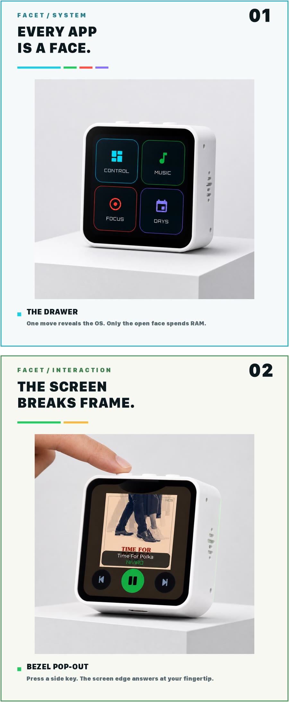
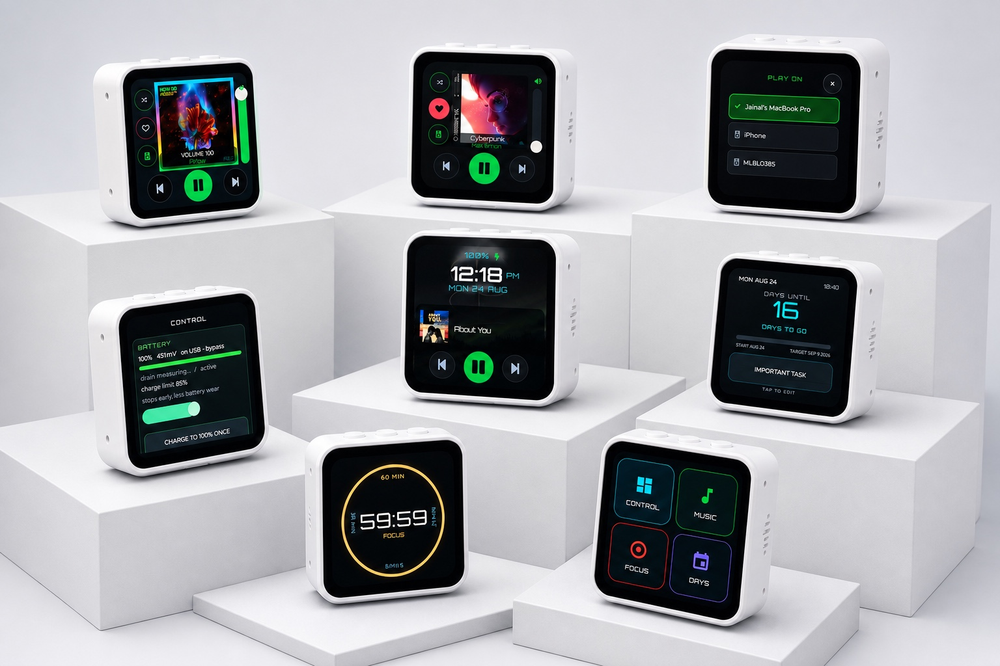

# Facet — phone exhibition

The same product story, paced one scene at a time for a phone screen.

<picture><source media="(prefers-color-scheme: dark)" srcset="images/facet-portraits-dark-mobile.jpg"></picture>

## Every face

<picture><source media="(prefers-color-scheme: dark)" srcset="images/screens-dark-mobile.jpg"></picture>

## The moments that make it Facet

<picture><source media="(prefers-color-scheme: dark)" srcset="images/moments-dark-mobile.jpg"></picture>

## The whole system

<picture><source media="(prefers-color-scheme: dark)" srcset="images/facet-ensemble.jpg"></picture>

[Back to the project README](../README.md)
